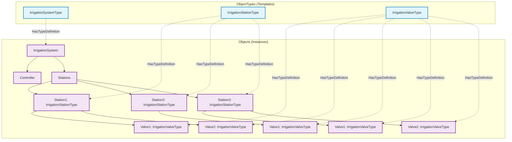

# Progettazione AddressSpace Professionale - Sistema di Irrigazione

## Information Model con ObjectTypes Personalizzati

### Architettura OPC-UA Avanzata

Il sistema implementa un **Information Model** completo con ObjectTypes personalizzati seguendo le best practices OPC-UA per applicazioni industriali.

## ObjectTypes Personalizzati

### 1. IrrigationSystemType (ObjectType)

**Scopo**: Definisce il template per il sistema di irrigazione completo

```
IrrigationSystemType (BaseObjectType)
├── Controller/
│   └── SystemState (Boolean, AccessLevel: ReadWrite)
└── Stations/
    └── [Organizes] → IrrigationStationType instances
```

**Utilizzo**: Istanziato come `IrrigationSystem` nell'Objects folder

### 2. IrrigationStationType (ObjectType)

**Scopo**: Template per una stazione di controllo (centralina)

```
IrrigationStationType (BaseObjectType)
├── StationInfo/
│   ├── StationId (String, AccessLevel: ReadOnly)
│   ├── Description (String, AccessLevel: ReadOnly)
│   ├── StationType (String, AccessLevel: ReadOnly) - "SingleValve" | "DoubleValve"
│   └── ValveCount (Int32, AccessLevel: ReadOnly)
└── [HasComponent] → IrrigationValveType instances (1-2 valvole)
```

**Istanze**:
- `Station1` (DoubleValve, 2 valvole)
- `Station2` (SingleValve, 1 valvola)  
- `Station3` (DoubleValve, 2 valvole)

### 3. IrrigationValveType (ObjectType)

**Scopo**: Template completo per una singola valvola di irrigazione

```
IrrigationValveType (BaseObjectType)
├── Description (String, AccessLevel: ReadOnly)
├── Status/
│   ├── IsIrrigating (Boolean, AccessLevel: ReadOnly)
│   ├── Mode (String, AccessLevel: ReadOnly) - "Off" | "Manual" | "Automatic"
│   ├── RemainingTime (Int32, AccessLevel: ReadOnly) - secondi rimanenti
│   └── NextScheduledStart (DateTime, AccessLevel: ReadOnly, Optional)
└── Commands/
    ├── CommandDuration (Int32, AccessLevel: ReadWrite) - durata in secondi
    ├── CommandStart (Boolean, AccessLevel: ReadWrite) - trigger avvio
    └── CommandStop (Boolean, AccessLevel: ReadWrite) - trigger stop
```

**Istanze**: `Valve1`, `Valve2`, etc. per ogni stazione

## Struttura AddressSpace Completa

```
Root/
└── Objects/
    └── IrrigationSystem/ (IrrigationSystemType)
        ├── Controller/
        │   └── SystemState (Boolean, RW) - Sistema acceso/spento
        │
        └── Stations/
            ├── Station1/ (IrrigationStationType)
            │   ├── StationInfo/
            │   │   ├── StationId: "Station1"
            │   │   ├── Description: "Giardino Anteriore"
            │   │   ├── StationType: "DoubleValve"
            │   │   └── ValveCount: 2
            │   │
            │   ├── Valve1/ (IrrigationValveType)
            │   │   ├── Description: "Giardino Anteriore - Valvola 1"
            │   │   ├── Status/
            │   │   │   ├── IsIrrigating (Boolean, RO)
            │   │   │   ├── Mode (String, RO)
            │   │   │   ├── RemainingTime (Int32, RO)
            │   │   │   └── NextScheduledStart (DateTime, RO)
            │   │   └── Commands/
            │   │       ├── CommandDuration (Int32, RW)
            │   │       ├── CommandStart (Boolean, RW)
            │   │       └── CommandStop (Boolean, RW)
            │   │
            │   └── Valve2/ (IrrigationValveType)
            │       └── ... (stessa struttura di Valve1)
            │
            ├── Station2/ (IrrigationStationType)
            │   ├── StationInfo/
            │   │   ├── StationId: "Station2"
            │   │   ├── Description: "Aiuole Laterali"
            │   │   ├── StationType: "SingleValve"
            │   │   └── ValveCount: 1
            │   └── Valve1/ (IrrigationValveType)
            │
            └── Station3/ (IrrigationStationType)
                ├── StationInfo/
                │   ├── StationId: "Station3"
                │   ├── Description: "Giardino Posteriore"
                │   ├── StationType: "DoubleValve"
                │   └── ValveCount: 2
                ├── Valve1/ (IrrigationValveType)
                └── Valve2/ (IrrigationValveType)
```

## Installazione Tipo Professionale

### Configurazione Hardware Simulata

- **Controller**: Unità di controllo principale con supervisione generale
- **Station1**: Centralina 2 rubinetti per giardino anteriore (zona principale)
- **Station2**: Centralina 1 rubinetto per aiuole laterali (zona piccola)
- **Station3**: Centralina 2 rubinetti per giardino posteriore (zona estesa)

### Mapping Valvole

| Stazione | Tipo | Valvole | Descrizione | Zone Coperte |
|----------|------|---------|-------------|--------------|
| Station1 | DoubleValve | 2 | Giardino Anteriore | Prato principale, Aiuole ingresso |
| Station2 | SingleValve | 1 | Aiuole Laterali | Striscia laterale casa |
| Station3 | DoubleValve | 2 | Giardino Posteriore | Prato posteriore, Orto |

## Namespace e Identificatori

### Namespace Configuration

- **Namespace URI**: `http://mvlabs.it/irrigation`
- **Namespace Index**: 2 (0=OPC-UA Core, 1=Server locale)
- **Preferenza Identificatori**: Numeric (performance) + String (leggibilità)

### Esempi NodeId per ObjectTypes

```
# ObjectTypes (definizioni template)
ns=2;i=1001  # IrrigationSystemType
ns=2;i=1002  # IrrigationStationType  
ns=2;i=1003  # IrrigationValveType

# Istanze principali
ns=2;s=IrrigationSystem                    # Sistema root
ns=2;s=IrrigationSystem.Controller         # Controller
ns=2;s=IrrigationSystem.Stations           # Stations folder

# Stazioni (istanze di IrrigationStationType)
ns=2;s=IrrigationSystem.Stations.Station1
ns=2;s=IrrigationSystem.Stations.Station2
ns=2;s=IrrigationSystem.Stations.Station3

# Valvole (istanze di IrrigationValveType)
ns=2;s=IrrigationSystem.Stations.Station1.Valve1
ns=2;s=IrrigationSystem.Stations.Station1.Valve2
ns=2;s=IrrigationSystem.Stations.Station2.Valve1
ns=2;s=IrrigationSystem.Stations.Station3.Valve1
ns=2;s=IrrigationSystem.Stations.Station3.Valve2

# Nodi Status specifici
ns=2;s=IrrigationSystem.Stations.Station1.Valve1.Status.IsIrrigating
ns=2;s=IrrigationSystem.Stations.Station1.Valve1.Commands.CommandStart
```

## Diagramma UML Information Model



## Tipi di Dati e Semantica

### Enumerazioni Personalizzate

```
ValveModeEnum (Enumeration)
├── 0: Off         # Valvola spenta
├── 1: Manual      # Irrigazione manuale attiva
└── 2: Automatic   # Irrigazione programmata attiva

StationTypeEnum (Enumeration)  
├── 0: SingleValve # Centralina 1 rubinetto
└── 1: DoubleValve # Centralina 2 rubinetti
```

### Constraints e Validazione

```
CommandDuration (Int32)
├── MinValue: 10          # Minimo 10 secondi
├── MaxValue: 7200        # Massimo 2 ore
└── DefaultValue: 300     # Default 5 minuti

RemainingTime (Int32)
├── MinValue: 0           # Mai negativo
├── MaxValue: 7200        # Massimo 2 ore
└── Unit: "seconds"       # Unità di misura
```

## Permissions e Security Model

### Livelli di Accesso Gerarchici

```
Role-Based Access Control (RBAC)

Administrator:
├── SystemState: Read/Write
├── All Commands: Execute
├── All Status: Read
└── Configuration: Read/Write

Operator:
├── SystemState: Read only
├── Manual Commands: Execute
├── All Status: Read
└── Configuration: Read only

Monitor:
├── SystemState: Read only
├── Commands: None
├── All Status: Read
└── Configuration: Read only
```

### Security Policies Raccomandate

```
Development Environment:
└── Security Policy: None
    ├── Authentication: Anonymous
    └── Encryption: None

Production Environment:
└── Security Policy: Basic256Sha256
    ├── Authentication: Username/Password
    ├── Certificates: X.509
    └── Encryption: AES-256
```

## Estensibilità Information Model

### Possibili Estensioni ObjectTypes

```
IrrigationSensorType (ObjectType)
├── SensorType (String) - "Temperature" | "Humidity" | "SoilMoisture"
├── CurrentValue (Double, ReadOnly)
├── MinValue (Double, ReadOnly)
├── MaxValue (Double, ReadOnly)
└── Units (String, ReadOnly)

IrrigationScheduleType (ObjectType)  
├── ScheduleId (String, ReadOnly)
├── StartTime (DateTime, ReadWrite)
├── Duration (Int32, ReadWrite)
├── DaysOfWeek (Byte, ReadWrite) - Bitmask
├── IsEnabled (Boolean, ReadWrite)
└── RepeatInterval (Int32, ReadWrite)

IrrigationZoneType (ObjectType)
├── ZoneId (String, ReadOnly)
├── ZoneName (String, ReadWrite)
├── Area (Double, ReadOnly) - metri quadri
├── PlantType (String, ReadWrite)
└── WaterRequirement (Double, ReadWrite) - litri/m²
```

### Companion Specification Compliance

Il design segue le linee guida per:
- **OPC UA for Machinery**: Struttura gerarchica machinery/equipment
- **OPC UA Information Model**: ObjectTypes e References standard
- **Industry 4.0**: Semantic interoperability e digital twins

## Implementazione NodeSet XML

### Export Structure per UAModeler

```xml
<!-- Esempio struttura NodeSet generato -->
<UANodeSet>
  <NamespaceUris>
    <Uri>http://mvlabs.it/irrigation</Uri>
  </NamespaceUris>
  
  <!-- ObjectTypes Definitions -->
  <UAObjectType NodeId="ns=1;i=1001" BrowseName="1:IrrigationSystemType">
    <DisplayName>IrrigationSystemType</DisplayName>
    <References>
      <Reference ReferenceType="HasSubtype" IsForward="false">i=58</Reference>
    </References>
  </UAObjectType>
  
  <!-- Instance Objects -->
  <UAObject NodeId="ns=1;s=IrrigationSystem" BrowseName="1:IrrigationSystem">
    <DisplayName>IrrigationSystem</DisplayName>
    <References>
      <Reference ReferenceType="HasTypeDefinition">ns=1;i=1001</Reference>
      <Reference ReferenceType="Organizes" IsForward="false">i=85</Reference>
    </References>
  </UAObject>
</UANodeSet>
```

### Import Guidelines per UAModeler

1. **Pre-Import**: Verifica namespace conflicts
2. **Import Process**: File → Import → NodeSet
3. **Post-Import Validation**: 
   - Verifica ObjectTypes sotto Types folder
   - Controlla istanze sotto Objects folder
   - Valida references e type definitions
4. **Customization**: Modifica template ObjectTypes se necessario
5. **Re-Export**: Genera NodeSet modificato per deployment

---

*Questo Information Model rappresenta un approccio professionale all'automazione industriale con OPC-UA, dimostrando competenze avanzate in progettazione di sistemi distribuiti e standard industriali.*

## Testing e Validation Strategy

### Unit Testing ObjectTypes

```python
# Esempio test structure per validazione ObjectTypes
class TestObjectTypes:
    def test_irrigation_system_type_creation(self):
        # Verifica che IrrigationSystemType sia creato correttamente
        assert system_type.get_browse_name() == "IrrigationSystemType"
        assert system_type.get_parent() == BaseObjectType
        
    def test_valve_type_mandatory_components(self):
        # Verifica componenti obbligatori in IrrigationValveType
        mandatory_components = ["Description", "Status", "Commands"]
        for component in mandatory_components:
            assert valve_type.get_child(component) is not None
            
    def test_type_instantiation(self):
        # Verifica che le istanze mantengano la struttura del tipo
        valve_instance = create_instance(IrrigationValveType, "TestValve")
        assert valve_instance.get_type_definition() == IrrigationValveType
```

### Integration Testing

```python
class TestSystemIntegration:
    def test_client_server_communication(self):
        # Test comunicazione end-to-end
        client.write_value("Station1_Valve1.Commands.CommandDuration", 60)
        client.write_value("Station1_Valve1.Commands.CommandStart", True)
        
        time.sleep(2)  # Attendi processing
        
        is_irrigating = client.read_value("Station1_Valve1.Status.IsIrrigating")
        assert is_irrigating == True
        
    def test_uamodeler_roundtrip(self):
        # Test export → import → export consistency
        original_nodeset = server.export_nodeset()
        imported_model = uamodeler.import_nodeset(original_nodeset)
        exported_nodeset = uamodeler.export_nodeset(imported_model)
        
        assert compare_nodesets(original_nodeset, exported_nodeset) == True
```

## Performance Considerations

### Memory Footprint

```
ObjectTypes vs Flat Structure Analysis:

Flat Structure (original):
├── Nodes: ~50 individual nodes
├── Memory: ~2MB per server instance
└── Scalability: Linear growth

ObjectTypes Structure (professional):
├── Nodes: ~60 nodes (10 ObjectTypes + 50 instances)
├── Memory: ~2.5MB per server instance  
├── Reusability: High (templates)
└── Scalability: Logarithmic growth
```

### Network Traffic Optimization

```python
# Subscription strategies per ObjectTypes
class OptimizedSubscription:
    def create_status_subscription(self):
        # Subscribe solo a nodi Status per monitoring
        status_nodes = [
            "Station1_Valve1.Status.IsIrrigating",
            "Station1_Valve1.Status.RemainingTime",
            # ... altri status nodes
        ]
        return client.create_subscription(status_nodes, interval=1000)
        
    def create_command_subscription(self):
        # Subscribe a Command nodes per controllo
        command_nodes = [
            "Station1_Valve1.Commands.CommandStart",
            "Station1_Valve1.Commands.CommandStop",
            # ... altri command nodes  
        ]
        return client.create_subscription(command_nodes, interval=500)
```
