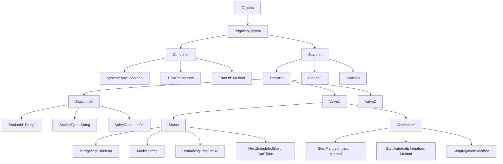

# Progettazione AddressSpace - Sistema di Irrigazione

## Struttura dell'AddressSpace

```
Root/
└── Objects/
    └── IrrigationSystem/
        ├── Controller/
        │   ├── SystemState (Boolean) - Acceso/Spento
        │   ├── TurnOn() (Method)
        │   └── TurnOff() (Method)
        │
        └── Stations/
            ├── Station1/
            │   ├── StationInfo/
            │   │   ├── StationId (String)
            │   │   ├── StationType (String) - "SingleValve" o "DoubleValve"
            │   │   └── ValveCount (Int32)
            │   │
            │   ├── Valve1/
            │   │   ├── Status/
            │   │   │   ├── IsIrrigating (Boolean)
            │   │   │   ├── Mode (String) - "Manual" o "Automatic"
            │   │   │   ├── RemainingTime (Int32) - secondi
            │   │   │   └── NextScheduledStart (DateTime)
            │   │   │
            │   │   └── Commands/
            │   │       ├── StartManualIrrigation(duration) (Method)
            │   │       ├── StartAutomaticIrrigation(startTime, duration) (Method)
            │   │       └── StopIrrigation() (Method)
            │   │
            │   └── Valve2/ (solo per centraline a 2 rubinetti)
            │       ├── Status/
            │       │   ├── IsIrrigating (Boolean)
            │       │   ├── Mode (String)
            │       │   ├── RemainingTime (Int32)
            │       │   └── NextScheduledStart (DateTime)
            │       │
            │       └── Commands/
            │           ├── StartManualIrrigation(duration) (Method)
            │           ├── StartAutomaticIrrigation(startTime, duration) (Method)
            │           └── StopIrrigation() (Method)
            │
            ├── Station2/
            │   └── ... (stessa struttura)
            │
            └── Station3/
                └── ... (stessa struttura)
```

## Installazione Tipo di Esempio

- **Controller**: 1 unità di controllo principale
- **Station1**: Centralina a 2 rubinetti (giardino anteriore)
- **Station2**: Centralina a 1 rubinetto (aiuole laterali)  
- **Station3**: Centralina a 2 rubinetti (giardino posteriore)

## Tipi di Dati Personalizzati

### StationInfo ObjectType
- StationId: String
- StationType: String ("SingleValve" | "DoubleValve")
- ValveCount: Int32

### ValveStatus ObjectType
- IsIrrigating: Boolean
- Mode: String ("Manual" | "Automatic" | "Off")
- RemainingTime: Int32 (secondi rimanenti)
- NextScheduledStart: DateTime

### ValveCommands ObjectType
- StartManualIrrigation(duration: Int32): StatusCode
- StartAutomaticIrrigation(startTime: DateTime, duration: Int32): StatusCode
- StopIrrigation(): StatusCode

## Namespace

- Namespace URI: `http://mvlabs.it/irrigation`
- Namespace Index: 2 (assumendo 0=OPC-UA, 1=locale)

## Diagramma UML dell'AddressSpace



## Esempi di NodeId

### Controller
- `ns=2;s=IrrigationSystem.Controller.SystemState`
- `ns=2;s=IrrigationSystem.Controller.TurnOn`
- `ns=2;s=IrrigationSystem.Controller.TurnOff`

### Stazioni
- `ns=2;s=IrrigationSystem.Stations.Station1.StationInfo.StationId`
- `ns=2;s=IrrigationSystem.Stations.Station1.Valve1.Status.IsIrrigating`
- `ns=2;s=IrrigationSystem.Stations.Station1.Valve1.Commands.StartManualIrrigation`

## Permissions e Security

### Livelli di Accesso
- **Read Only**: Tutti i nodi Status
- **Read/Write**: SystemState (solo per admin)
- **Execute**: Tutti i metodi Commands (autenticazione richiesta)

### Security Policies
- **None**: Per testing e sviluppo
- **Basic128Rsa15**: Per ambienti di produzione
- **Basic256Sha256**: Raccomandato per sicurezza massima